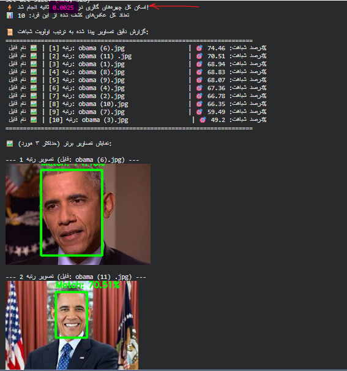
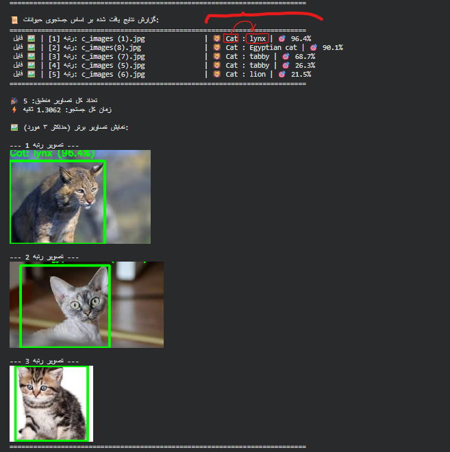
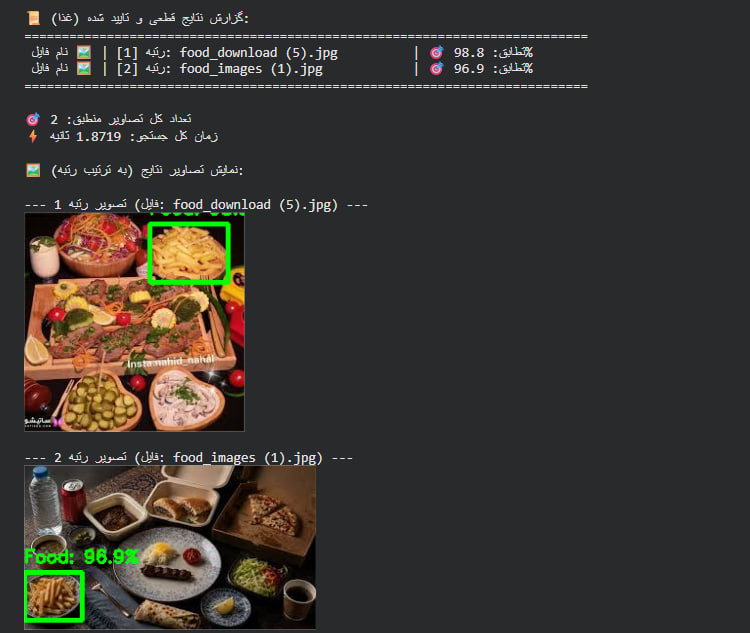
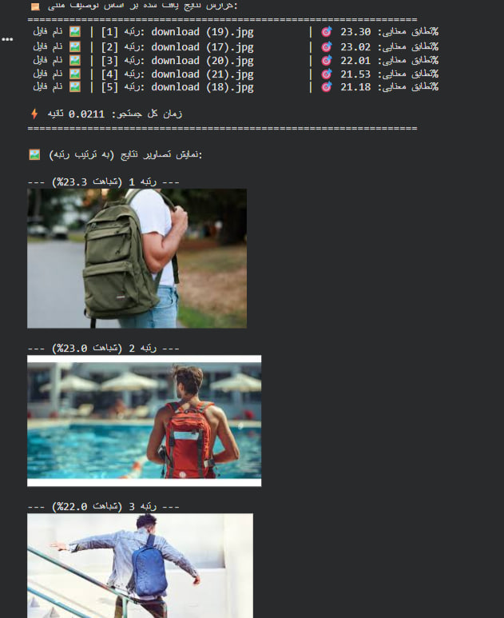

<div align="center">

# Visual Intelligence Engine

**Multimodal search over an image archive — faces, species, food and free text, on one index.**

[](https://github.com/ParsaVictor/visual-intelligence-engine/actions/workflows/ci.yml)
[](https://www.python.org/)
[](tests/)

Find *"that photo of the minister at the ceremony"* in an archive of tens of
thousands of unlabelled press photos — by face, by species, by dish, or by
describing it in plain English.

<div dir="rtl">

جستجوی چندوجهی روی آرشیو تصویری: تشخیص چهره، گونه‌ی جانوری، غذا و جستجوی متنی آزاد — همه روی یک ایندکس واحد.

</div>

</div>

---

## Demo

| Face search | Species search |
|:--|:--|
|  |  |
| **Food search** | **Free-text search** |
|  |  |

## What it does

| Query | Input | Returns |
|:--|:--|:--|
| 👤 **Face** | a photo of a person | every image containing that person, ranked by similarity |
| 🦁 **Species** | a word — `zebra`, `red panda` | images containing that animal, with the detection boxed |
| 🍱 **Food** | a dish name — `French fries` | images containing that dish, even in a crowded table scene |
| 🌐 **Free text** | any description | images matching semantically, with no fixed vocabulary |

## How it works

Heavy models run **once per image at index time**. Each image gets three cheap
boolean flags plus its embeddings; a query narrows the candidate set with plain
SQL first, then runs vector search only on what survives.

```
index:  image → face · animal · food detectors → flags + embeddings → SQLite
query:  SQL prefilter → vector search on candidates only → ranked results
```

Because the flags come from *class-agnostic* detectors, the recogniser can be
swapped without re-indexing anything — which is exactly what happened when the
species path moved from an ImageNet classifier to CLIP.

See **[docs/architecture.md](docs/architecture.md)** for the full data flow and
**[docs/design-decisions.md](docs/design-decisions.md)** for why the non-obvious
choices were made.

## Models

Five pretrained models, none fine-tuned. The engineering is in the combination.

| Model | Role | Output |
|:--|:--|:--|
| InsightFace `buffalo_l` | RetinaFace detection + ArcFace recognition | 512-d unit vector |
| MegaDetector v5a | class-agnostic animal localiser | boxes |
| RT-DETR-X | food and tableware detection | boxes (COCO) |
| CLIP ViT-L/14 | shared image ↔ text space | 768-d unit vector |

## Install

```bash
git clone https://github.com/ParsaVictor/visual-intelligence-engine.git
cd visual-intelligence-engine
python -m venv .venv && source .venv/bin/activate   # Windows: .venv\Scripts\activate

pip install -e ".[models]"     # full stack, needs a GPU for practical speed
pip install -e ".[dev]"        # core logic + test suite only, no torch
```

The core logic has no torch dependency, so the test suite installs and runs in
seconds on any machine.

## Usage

Put your images in `data/gallery/`, then:

```bash
vie index
```

```bash
vie search face   --image query.jpg
vie search animal --query "red panda"
vie search food   --query "French fries"
vie search text   --query "a man with a blue backpack"
vie search text   --query "sunset over the city" --json
```

Every threshold and class list lives in [`configs/default.yaml`](configs/default.yaml).
Point at your own with `--config`.

## Interactive demo

```bash
pip install -e ".[demo]"
python -m vie.demo
```

## Configuration

```yaml
face:
  match_threshold: 0.46        # cosine on ArcFace embeddings

animal:
  gate_confidence: 0.30        # index time — must be ≤ search_confidence
  search_confidence: 0.40      # query time
  match_threshold: 0.55        # CLIP posterior against rival prompts

food:
  gate_classes:   [39, ..., 55]   # COCO; 56 is 'chair' and excluded
  search_classes: [45, ..., 55]   # must be a subset of gate_classes
  match_threshold: 0.60
```

`Config.validate()` rejects a gate stricter than its search pass, or a search
class the gate never indexed. Both were real defects in the original.

## Testing

```bash
pytest
```

120 tests, no GPU or model download required. Each one that references a `P1-*`
or `P2-*` id pins a specific historical defect so it cannot silently return.

## Status

| Area | State |
|:--|:--|
| Four query paths | ✅ |
| Installable package + CLI | ✅ |
| Known correctness defects fixed & pinned | ✅ |
| Tests & CI | ✅ 120 tests, Python 3.10 / 3.12 |
| **Measured benchmarks** | ⬜ **not yet run — no performance figures are claimed** |

`scripts/benchmark.py` exists to produce them; the numbers will be published
here with hardware and dataset size stated, and not before.

## Privacy

This system extracts and stores **biometric identifiers of identifiable
people**. The gallery and the generated database are excluded from version
control and must never be committed. Anyone deploying it is responsible for
having a lawful basis to process the images. See [ROADMAP.md](ROADMAP.md) P0-3.

## Roadmap

[ROADMAP.md](ROADMAP.md) tracks the remaining work in phases, mirrored on the
project board.

## Acknowledgements

[MegaDetector](https://github.com/agentmorris/MegaDetector) ·
[InsightFace](https://github.com/deepinsight/insightface) ·
[OpenAI CLIP](https://github.com/openai/CLIP) ·
[Ultralytics](https://github.com/ultralytics/ultralytics)

## License

To be determined pending an ownership decision on the original work.
