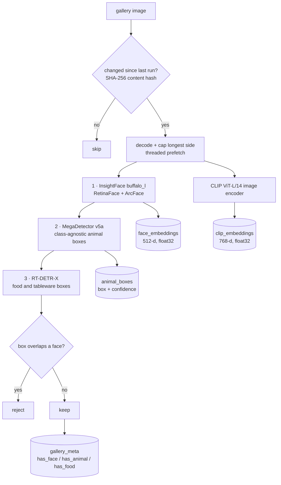
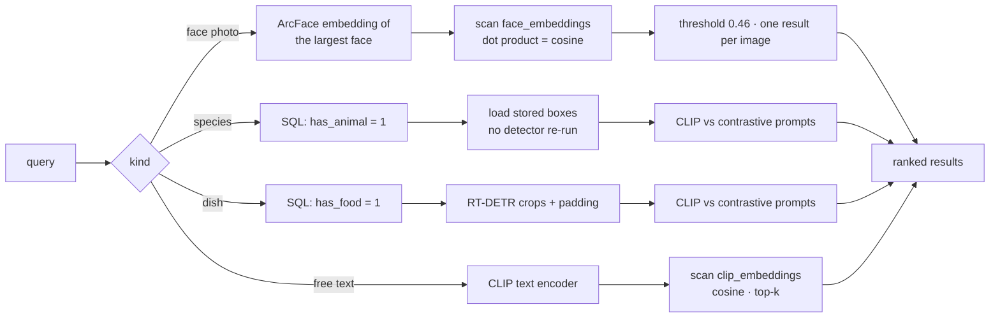

# Architecture

Two phases: heavy models run **once per image at index time**, queries run only
over what the index already knows.

> **On the original diagram.** `docs/architecture-original.png` is kept for
> history, but it claimed four things the code never did: a FAISS index (there
> was a plain NumPy loop, and no faiss import anywhere), a "120-species
> dictionary" (there were 8 keyword buckets — the number 120 came from a comment
> about ImageNet's 120 *dog breeds*), MobileNetV3 running at index time (it ran
> only at query time), and stored MegaDetector crops (nothing was stored). FP16
> was also listed as a global optimisation when only CLIP was ever half
> precision. The diagrams below describe what the code actually does.

## Indexing



**Stage order is load-bearing.** Faces must be detected before food, because the
food stage rejects boxes that sit on a face. The original ran animal → food →
face, so that guard read variables that had not been assigned yet and was always
false. `vie.indexing.STAGE_ORDER` is asserted by test.

## Querying



## The prefilter

The single most important design decision. Each image carries three booleans, so
a species query never touches an image with no animal in it:

```sql
SELECT file_name, file_path FROM gallery_meta WHERE has_animal = 1;
```

The flags come from *class-agnostic* detectors, which is what makes them durable:
MegaDetector answers "is there an animal", not "which species". Swapping the
recogniser — as this project did, from MobileNetV3 to CLIP — requires no
re-indexing at all.

## Models

| Model | Stage | Precision | Output |
|:--|:--|:--|:--|
| InsightFace `buffalo_l` | index + face query | FP32 (ONNX) | 512-d unit vector |
| MegaDetector v5a | index | FP32 | boxes, class 0 = animal |
| RT-DETR-X | index + food query | FP32 | boxes, COCO classes |
| CLIP ViT-L/14 | index + 3 query paths | FP16 on CUDA | 768-d unit vector |

None are fine-tuned. The engineering is in the combination, the index and the
decision rules — not in training.

## Schema

```sql
gallery_meta(file_name PK, file_path, content_hash, file_size,
             has_face, has_animal, has_food)
face_embeddings(file_name, bbox, embedding, PRIMARY KEY (file_name, bbox))
clip_embeddings(file_name PK, embedding)
animal_boxes(file_name, bbox, confidence, PRIMARY KEY (file_name, bbox))
```

`face_embeddings` originally had no primary key, so every re-index duplicated
every face. `(file_name, bbox)` is the natural key: idempotent per face, while
still keeping two distinct faces in one photo.
